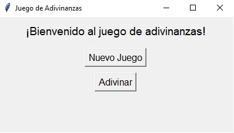
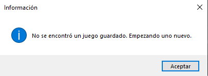
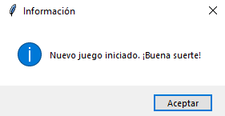
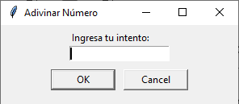
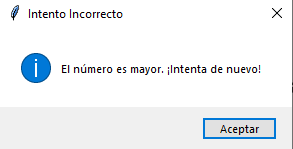
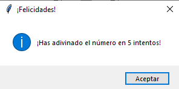

# Application-Checkpointing
 Pequeño programa sobre adivinanzas el cual restaura tus intentos.

# Manual

## Juego de adivinanzas
Este juego te desafiará a adivinar un número secreto en la menor cantidad de intentos posibles. Sigue las instrucciones a continuación para disfrutar del juego.

## Iniciar la aplicación
1. Ejecuta el script en Python proporcionado (juego_adivinanzas.py).
2. Se abrirá una ventana con el título "Juego de Adivinanzas" y dos botones: "Nuevo Juego" y "Adivinar".
   

## Nuevo Juego
* Al iniciar el juego, sino se encuentra un estado guardado creará uno nuevo.

* Haz clic en el botón "Nuevo Juego" para iniciar una nueva partida.
* El juego generará automáticamente un nuevo número secreto entre 1 y 10.
* Aparecerá un mensaje indicando que se ha iniciado un nuevo juego y te deseará buena suerte.

## Adivinar
* Haz clic en el botón "Adivinar" para ingresar tu intento de adivinar el número secreto.
* Se abrirá un cuadro de diálogo pidiéndote que ingreses tu intento.

* Ingresa un número y presiona "Aceptar".

## Resultados
* Después de cada intento, recibirás un mensaje informándote si el número ingresado es mayor, menor o igual al número secreto.

* Si adivinas el número, recibirás un mensaje de felicitación y se iniciará automáticamente un nuevo juego.

## Guardar y Cargar Juego
* El juego guarda automáticamente tu progreso después de cada intento.
* Al cerrar la ventana del juego, tu progreso se guardará en un archivo llamado "estado_juego.pkl".
* Cuando vuelvas a ejecutar el juego, tu estado anterior se cargará automáticamente, permitiéndote continuar donde lo dejaste.

## Cierre de la Aplicación
* Puedes cerrar la ventana principal haciendo clic en la "X" en la esquina superior derecha.
* Si cierras la ventana mientras estás en medio de un juego, se guardará tu progreso actual.
* La aplicación se cerrará completamente cuando la ventana principal se cierre.

### Nota:
En la carpeta "Ejecutable" se encuentra el archivo ".exe" del programa para mayor comodidad en caso de que no puedas utilizar el script directamente en un IDLE.
